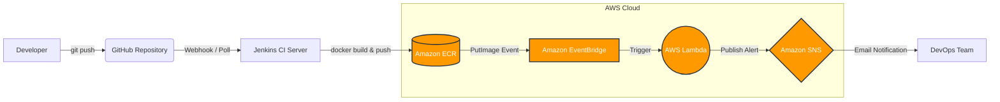

# Automated ECR Deployment Pipeline 🚀

## Project Scenario
In many traditional environments, container images are built and pushed to registries manually, leading to version conflicts, missed updates, and a lack of post-deployment automation. 

**Objective:** This project solves that problem by implementing a fully automated CI/CD pipeline. It automatically builds a Docker image from source code, pushes it to Amazon Elastic Container Registry (ECR), and triggers a serverless AWS Lambda function to handle post-deployment alerting via Amazon SNS.

---

## Architecture Diagram


## Pipeline Logic & Stages
This pipeline is defined as code (Jenkinsfile) and executes the following automated stages:

1. **Checkout Code:** Jenkins connects to the GitHub repository and pulls the latest source code, Dockerfile, and application dependencies.

2. **Build Docker Image:** Jenkins executes the docker build command, packaging the Python/Flask application into a lightweight, portable container image tagged with the specific Jenkins build number for strict version control.

3. **Push to Amazon ECR:** Jenkins securely authenticates with AWS using temporary credentials from an assigned IAM EC2 Instance Profile.

  -  The image is tagged as latest and pushed to the private Amazon ECR repository.

4. Post-Deployment Automation (Serverless):

  -  EventBridge constantly monitors the ECR repository via AWS CloudTrail API calls.

  -  Upon detecting a successful PutImage event, it triggers a designated AWS Lambda function.

  -  The Python-based Lambda function parses the event details (repository name and image tag) and formats a message.

  -  It securely publishes this message to an Amazon SNS topic, instantly notifying the team via email that the deployment is complete.

## Technologies & Tools
- **Containerization:** Docker

- **CI/CD Automation:** Jenkins, Groovy (Declarative Pipeline)

- **Cloud Provider:** Amazon Web Services (AWS)

- **Container Registry:** Amazon Elastic Container Registry (ECR)

- **Serverless Compute:** AWS Lambda (Python boto3)

- **Event Management:** Amazon EventBridge

- **Notifications:** Amazon Simple Notification Service (SNS)

- **Version Control:** Git & GitHub

## Deliverables Included in this Repository
- **app.py & requirements.txt:** The sample Python Flask web application.

- **Dockerfile:** The instructions to containerize the application.

- **Jenkinsfile:** The declarative CI/CD pipeline script.

- **lambda_function.py:** The post-deployment automation logic.

***

### How to add this to your repo:
1. On your computer, open your `cicd-ecr-pipeline` folder.
2. Create a new file named `README.md`.
3. Paste the markdown text above into the file and save it.
4. Run these terminal commands to push it:
   ```bash
   git add README.md
   git commit -m "Add final project README and architecture diagram"
   git push origin main
